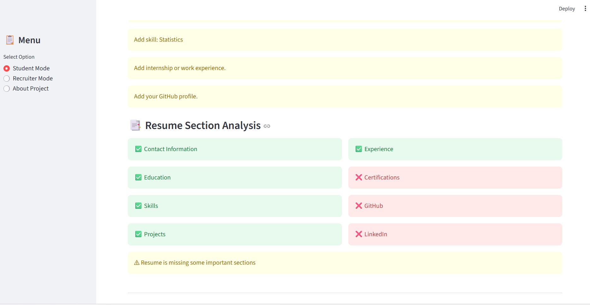
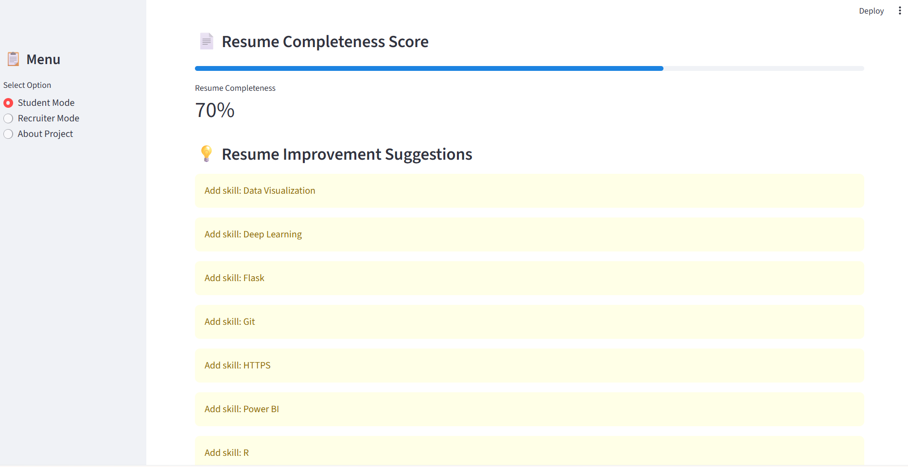
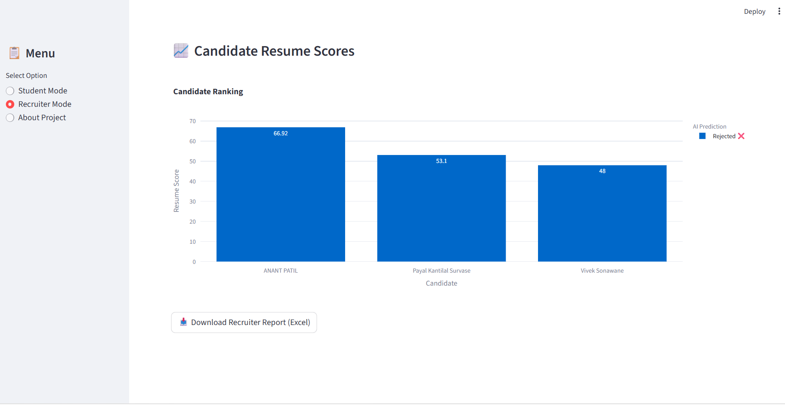

# 📄 AI Resume Screening System

## 📌 Overview

AI Resume Screening System is a Machine Learning and NLP-based web application that helps recruiters and job seekers analyze resumes. The system compares resumes with job descriptions, calculates ATS scores, predicts shortlisting chances, identifies missing skills, and provides personalized improvement suggestions.

---

## 🚀 Features

### 👨‍🎓 Student Mode
- Upload Resume (PDF/DOCX)
- AI Resume Parsing
- ATS Score Calculation
- Resume-JD Matching
- Resume Completeness Score
- Missing Skills Detection
- Resume Improvement Suggestions
- Resume Strengths & Weaknesses
- Resume Score Dashboard
- Download Resume Analysis Report

---

### 🏢 Recruiter Mode
- Upload Multiple Resumes
- Automatic Candidate Ranking
- ATS Score Comparison
- Resume Score Comparison
- Experience Comparison
- Project Count Analysis
- Best Candidate Identification

---

## 🛠 Technologies Used

- Python
- Streamlit
- Pandas
- Scikit-Learn
- spaCy
- Plotly
- Git
- GitHub

---

## 📂 Project Structure

```
AI-Resume-Screening-System
│
├── app.py
├── ats_score.py
├── job_descriptions.py
├── skill_aliases.py
├── requirements.txt
│
├── assets/
├── data/
└── models/
```

---

## ⚙ Installation

Clone the repository

```bash
git clone https://github.com/payalsurvase/AI-Resume-Screening-System.git
```

Go to project folder

```bash
cd AI-Resume-Screening-System
```

Create virtual environment

```bash
python -m venv venv
```

Activate virtual environment

Windows

```bash
venv\Scripts\activate
```

Install dependencies

```bash
pip install -r requirements.txt
```

Run the application

```bash
streamlit run app.py
```

---

## 📊 Functionalities

- Resume Parsing
- ATS Score
- Resume Score
- Job Description Matching
- Missing Skill Detection
- Resume Completeness Analysis
- Candidate Ranking
- Resume Suggestions
- Recruiter Dashboard

---

## 🔮 Future Enhancements

- AI Interview Question Generator
- Resume Chatbot
- Resume Keyword Optimizer
- Company-wise ATS Templates
- Email Resume Report
- Cloud Deployment

---

## 👩‍💻 Author

**Payal Survase**

Computer Engineering Student

GitHub:
https://github.com/payalsurvase


# Screenshots

## 🏠 Home Page


---

## 📄 Resume Upload


---

## 🛠 Skills Analysis


---

## 📊 Resume Performance


---

## 💡 Resume Suggestions


---

## 📑 Resume Section Analysis



---

## 🚀 Resume Improvement Suggestions



---

## 🏆 Resume Ranking Table


---

## ⭐ Ranking Score

